# PROJETO DE SOFTWARE - _Fórmula X_

## *STAKEHOLDERS*
|STAKEHOLDER|INTERESSE NO SISTEMA|
|:---|:---|
|Instituição de Ensino|Assegurar um ensino de qualidade, visando fornecer uma plataforma gratuita de cursos para serem usadas por alunos e professores.|
|Professores|Alinhar os cursos aos conteúdo acadêmicos.|
|Alunos|Obter acesso a conteúdos gratuitos, garantindo conhecimentos extras além do conteúdo ministrado em sala de aula.|

# SUMÁRIO

* [RESUMO DO PROJETO](#resumo-do-projeto)
* [INTRODUÇÃO](#introdução)
  * [PROPÓSITO DESTE DOCUMENTO](#propósito-deste-documento)
  * [CONCEPÇÃO DO SISTEMA](#concepção-do-sistema)
* [DESCRIÇÃO GERAL](#descrição-geral)
  * [USUÁRIOS DO SISTEMA](#usuários-do-sistema)
  * [SISTEMAS SIMILARES](#sistemas-similares)
  * [SUPOSIÇÕES E DEPENDÊNCIAS](#suposições-e-dependências)
* [ESTUDO DE VIABILIDADE](#estudo-de-viabilidade)
* [METODOLOGIA ADOTADA NO DESENVOLVIMENTO](#metodologia-adotada-no-desenvolvimento)
* [REQUISITOS DO SOFTWARE](#requisitos-do-software)
  * [REQUISITOS FUNCIONAIS](#requisitos-funcionais)
  * [REQUISITOS NÃO FUNCIONAIS](#requisitos-não-funcionais)
* [PROTOTIPAGEM](#prototipagem)
* [DIAGRAMA DE CASOS DE USO](#diagrama-de-casos-de-uso)
  * [ESPECIFICAÇÃO DOS CASOS DE USO](#descrição--especificação-dos-casos-de-uso)
* [DIAGRAMA DE CLASSES](#diagrama-de-classes)
* [DIAGRAMAS DE SEQUÊNCIA](#diagramas-de-sequência)
* [DIAGRAMAS DE ATIVIDADE](#diagramas-de-atividade)
* [EQUIPE DE DESENVOLVIMENTO E CLIENTE](#equipe-de-desenvolvimento-e-cliente)
  * [DESENVOLVEDORES](#desenvolvedores)
  * [CLIENTE](#cliente)
* [REFERÊNCIAS](#referências)

# RESUMO DO PROJETO

|ITEM| DETALHES|
|:---|:---|
| NOME|Fórmula X. |
| Lider do Projeto|Matheus Lucas Batista. |
| Principal Objetivo |Prototipar uma plataforma de gerenciamento de cursos. |
| Benefícios Esperados |Redução de custos com licenças de cursos, Autonomia de criação de conteúdo, Democratização do ensino. |
| Início e Término Previstos |01/10/2024 - 11/03/2025. |

# INTRODUÇÃO
A plataforma "Fórmula X" nasceu da necessidade de disponibilizar conteúdos extras e promover a continuidade do aprendizado, principalmente para alunos que precisam de aprofundamento em disciplinas específicas. Utilizamos como referência a ideia de MOOC (Massive Open Online Courses) para atingir um maior número de pessoas, oferecendo flexibilidade e escalabilidade.  

## PROPÓSITO DESTE DOCUMENTO

O objetivo deste documento é descrever a concepção do sistema, seus requisitos, escopo e metodologia de desenvolvimento adotada, servindo como base para a equipe na implementação e sustentação do projeto.  

## CONCEPÇÃO DO SISTEMA

Métodos utilizados para a obtenção dos requisitos do sistema:  
  * Brainstorming e discussões entre os stakeholders;  
  * Análise de necessidades e expectativas de alunos;  
  * Protótipos iniciais no Figma;  
  * Definição de prioridades e funcionalidades-chave por meio de Kanban.
    
---  

# DESCRIÇÃO GERAL

### USUÁRIOS DO SISTEMA
|USUÁRIO|DESCRIÇÃO|
|:---|:---|
|Administrador|Responsável pela gestão do sistema e administração e produção dos conteúdos mantidos na plataforma.|
|Alunos|Consumidores dos conteúdos presentes na plataforma.|

### SISTEMAS SIMILARES:
O projeto se assemelha a plataformas como Coursera(https://www.coursera.org) e Udemy(https://www.udemy.com), cujos objetivos incluem a hospedagem, organização e disponibilização de cursos de diversos temas. No entanto, a “Fórmula X” busca oferecer uma experiência mais direcionada a conteúdos complementares de acordo com as necessidades de cada aluno na instituição.

### SUPOSIÇÕES E DEPENDÊNCIAS

Os usuários poderão acessar a plataforma através de computadores ou dispositivos móveis com acesso à internet para usufruir dos conteúdos disponibilizados. Como se trata de uma aplicação web, não há uma configuração mínima específica para visualização. No entanto, para os responsáveis pela administração do sistema, é recomendado o uso de um computador para a criação e gestão dos cursos, já que essas atividades exigem maior interação com as funcionalidades de gerenciamento.

---  

# ESTUDO DE VIABILIDADE

Após identificar a demanda por material de apoio em formato virtual, analisou-se a viabilidade técnica e financeira do projeto, considerando os recursos necessários para hospedagem, desenvolvimento e manutenção. Concluiu-se que a criação de uma plataforma MOOC é viável, trazendo benefícios de acessibilidade e flexibilidade na aprendizagem.  

--- 

# METODOLOGIA ADOTADA NO DESENVOLVIMENTO
Foi adotado um modelo de desenvolvimento baseado em Kanban, contemplando análise de Throughput, Lead Time e Cycle Time para monitorar o progresso do projeto. Também foram utilizados protótipos no Figma para validação prévia da interface, além de revisões e ajustes contínuos com a equipe.  

[ [INÍCIO](#projeto-de-software---fórmula-x) ]

---  

# REQUISITOS DO SOFTWARE

A especificação dos requisitos deste projeto segue as recomendações da norma IEEE Std-830-1998, considerando as boas práticas para definição de requisitos.  

## REQUISITOS FUNCIONAIS

A tabela a seguir contém a relação dos Requisitos Funcionais elicitados, com as colunas: identificador, nome e descrição:

| IDENTIFICADOR | NOME                    | DESCRIÇÃO                                                                                                                                          |  
|:-------------|:------------------------|:----------------------------------------------------------------------------------------------------------------------------------------------------|  
| **RF-001**   | Manter Cursos        | Permite o administrador criar, atualizar e remover cursos, bem como incluir conteúdos extras para disponibilizar aos alunos.             |
| **RF-002**   | Incorporar Vídeos     | Permite o administrador incorporar vídeos do Youtube.            |
| **RF-003**   | Gerenciar Conteúdo Extra | O administrador pode gerenciar os conteúdos extras dos cursos, como PDFs. |
| **RF-004**   | Manter Usuários |  Permite o administrador criar e remover e tornar administrador os usuários. |
| **RF-005**   | Acompanhar Progresso     | O administrador pode acompanhar o progresso dos alunos em cada curso. |
| **RF-006**   | Acompanhar o Próprio Progresso       | Os usuários podem acompanhar o próprio progresso em cada curso. |

## REQUISITOS NÃO FUNCIONAIS
A tabela a seguir contém a relação com os Requisitos Não Funcionais identificados, contendo identificador, nome e descrição:

| IDENTIFICADOR | NOME                           | DESCRIÇÃO                                                                                                |  
|:-------------|:-------------------------------|:----------------------------------------------------------------------------------------------------------|  
| **RNF-001**  | Desempenho e Escalabilidade                      | O sistema deve suportar simultaneamente pelo menos 100 usuários ativos sem degradação perceptível de desempenho, garantindo um tempo de resposta de no máximo 1 segundo. |  
| **RNF-002**  | Usabilidade                     | A interface deve ser intuitiva e claras tanto para administradores quanto para usuários. |  
| **RNF-003**  |Acessibilidade Multiplataforma             | O sistema será acessível via navegador, com design responsivo para dispositivos móveis, permitindo aos usuários acessarem os cursos de qualquer lugar. |
| **RNF-004**  | Formato Markdown                  | O sistema possuirá campos de textos em formato Markdown para que seja realizada a formatação da maneira que desejar nos campos de texto. |
---  

# PROTOTIPAGEM
Os protótipos de telas foram desenvolvidos no Figma, representando o fluxo de navegação, a apresentação de cursos e as funcionalidades de gerenciamento de conteúdo.  

## Fluxo Usuário
  

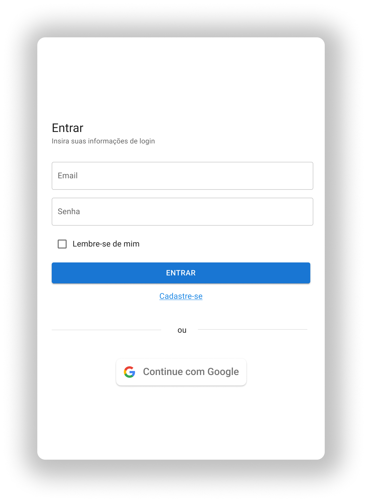  

  

  

  

 

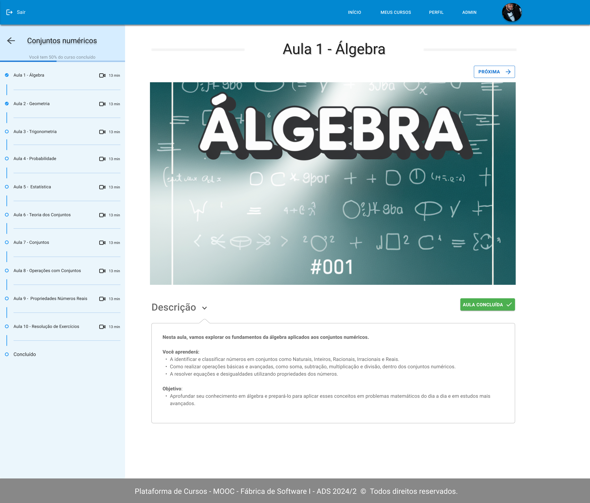  

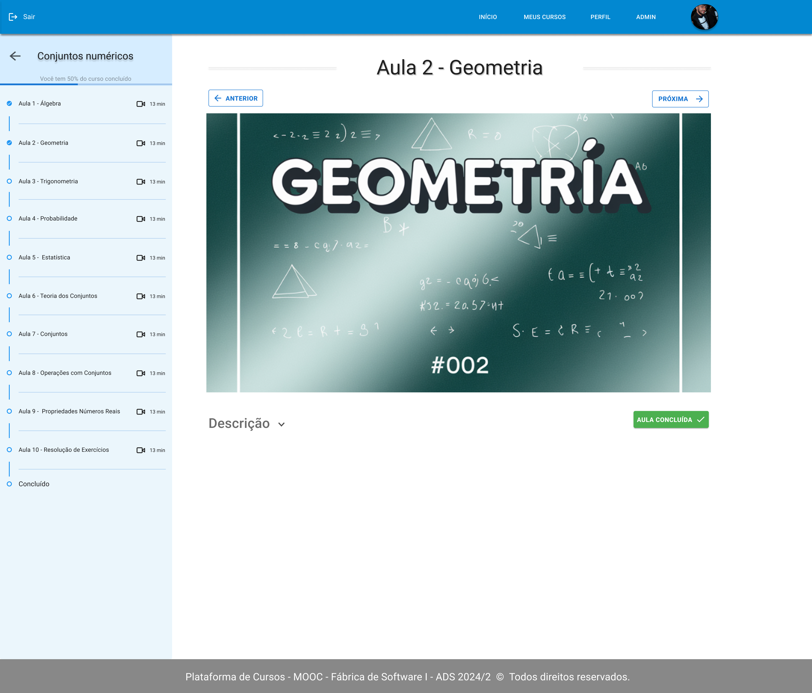    

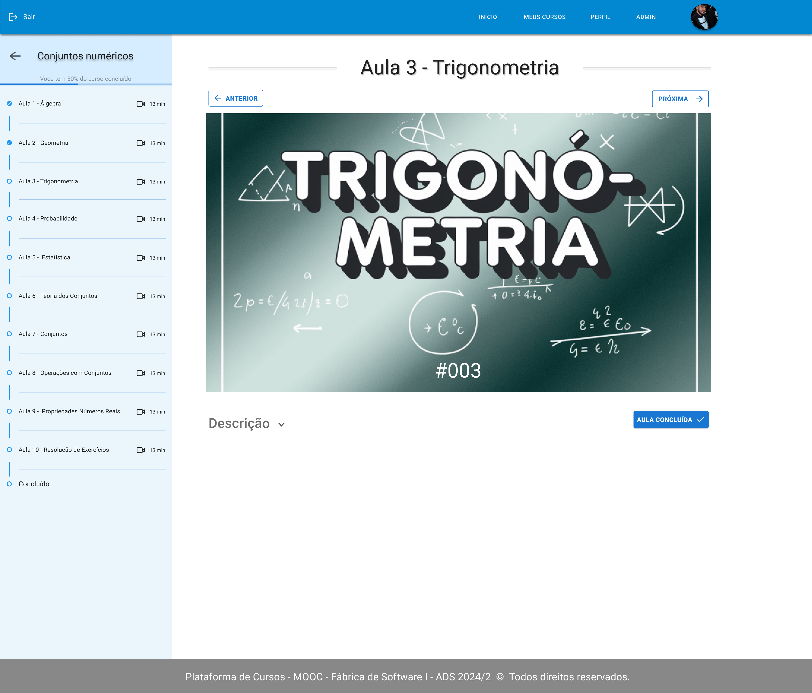  

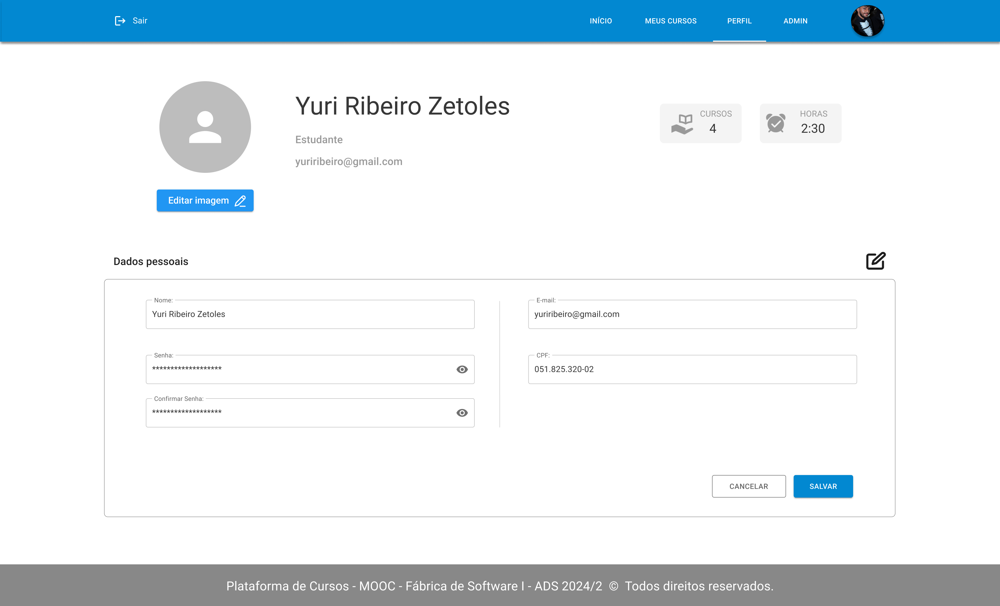

## Fluxo Administrador
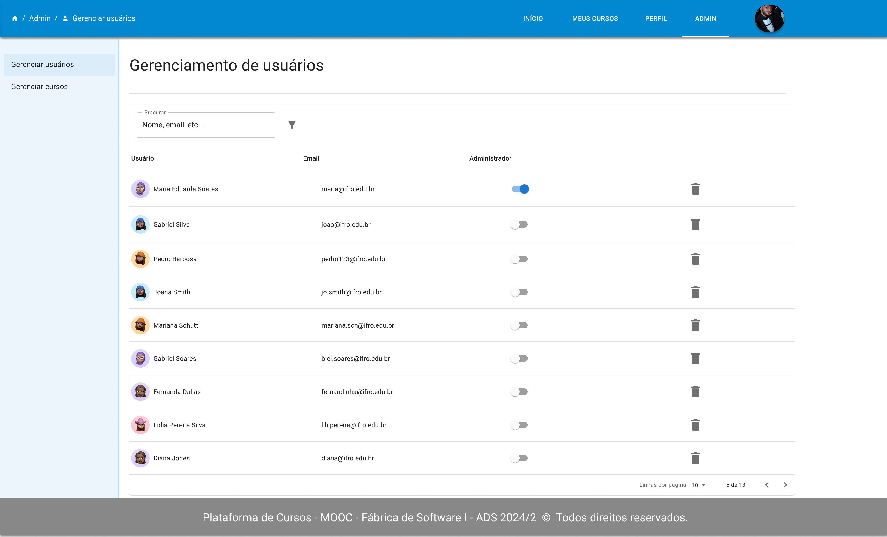  

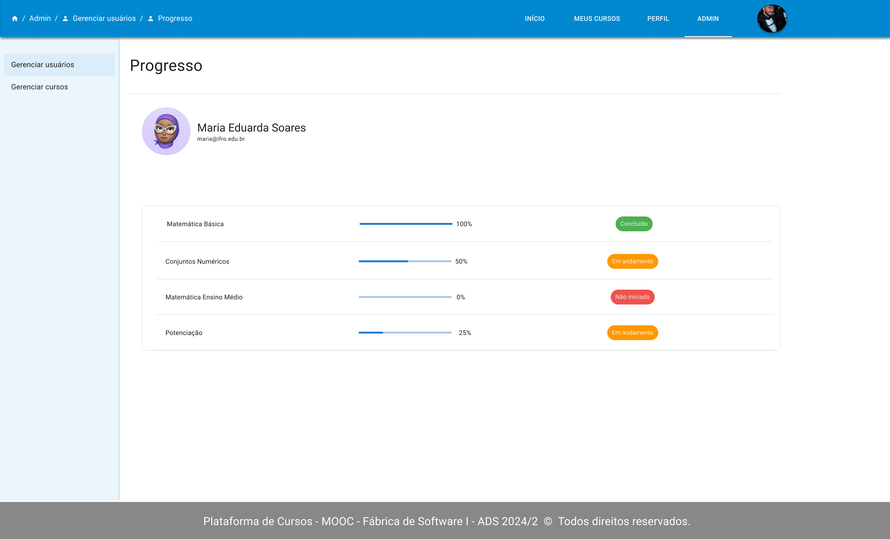  

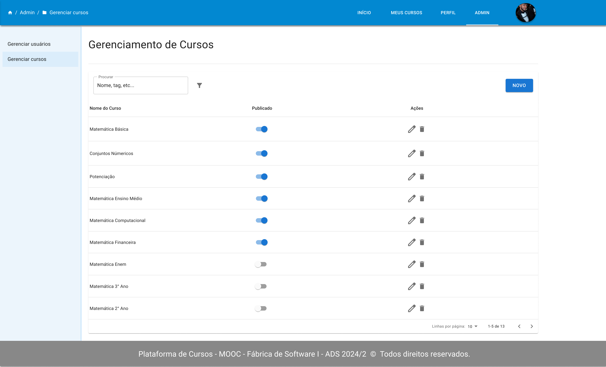 

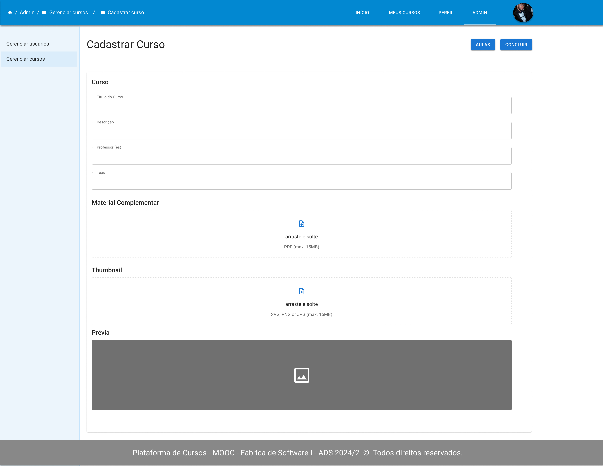

  

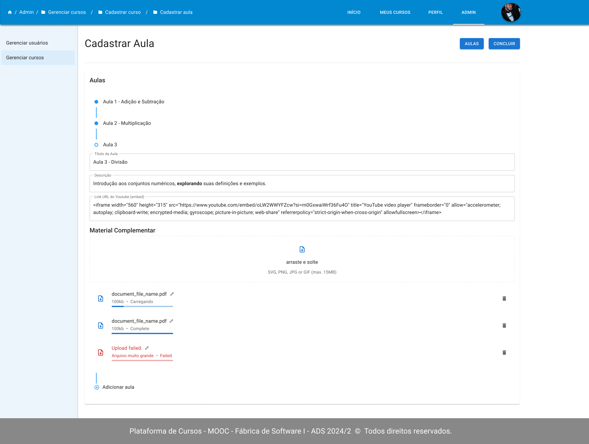 

<!-- 

  

  

  

  

  

  

  

  

  

  

  

  

  

  

  

------------------------------------------------

-->

[ [INÍCIO](#projeto-de-software---fórmula-x) ]

# DIAGRAMA DE CASOS DE USO

## DESCRIÇÃO / ESPECIFICAÇÃO DOS CASOS DE USO

### UC-01 - Login  

| **UC-01 - Login**       |  
|:------------------------|  
| **Descrição/Objetivo:** Permitir que o usuário entre no sistema utilizando credenciais. |  
| **Atores:** Usuário  |  
| **Pré-condições:** O usuário deve ter um perfil cadastrado no sistema. |  
| **Pós-condições:** O usuário é redirecionado para o dashboard. |  
| **Fluxo Principal / Básico:**       |  
| 1. O usuário acessa a tela de login. |  
| 2. Insere seu nome de usuário e senha. |  
| 3. O sistema autentica as credenciais e redireciona para o a tela inicial do sistema. |  
| **Fluxos Alternativos / Exceções:** |  
| **A1: Credenciais inválidas** |  
| 1. O sistema exibe uma mensagem de erro informando que as credenciais estão incorretas. |  

### UC-02 - Cadastrar  

| **UC-02 - Cadastrar**       |  
|:-----------------------------|  
| **Descrição/Objetivo:** Permitir que novos usuários se registrem no sistema. |  
| **Atores:** Usuário  |  
| **Pré-condições:** O usuário não deve estar autenticado. |  
| **Pós-condições:** Um novo perfil é criado no sistema. |  
| **Fluxo Principal / Básico:**       |  
| 1. O usuário acessa a tela de cadastro. |  
| 2. Preenche os campos obrigatórios (nome, e-mail, senha). |  
| 3. O sistema valida as informações e cria um novo perfil. |  
| **Fluxos Alternativos / Exceções:** |  
| **A1: E-mail já cadastrado** |  
| 1. O sistema informa que o e-mail já está em uso e solicita outro. |  

### UC-03 - Acompanhar Progresso  

| **UC-03 - Acompanhar Progresso**       |  
|:----------------------------------------|  
| **Descrição/Objetivo:** Monitorar seu progresso acadêmico. |  
| **Atores:** Usuário  |  
| **Pré-condições:** O usuário deve estar autenticado. |  
| **Pós-condições:** O usuário visualiza seu progresso atualizado. |  
| **Fluxo Principal / Básico:**       |  
| 1. O usuário acessa a seção de acompanhamento de progresso. |  
| 2. Visualiza os cursos, tarefas e atividades concluídas. |  
| 3. O sistema exibe gráficos e estatísticas relacionadas ao progresso acadêmico. |  

### UC-04 - Gerenciar Usuários  

| **UC-04 - Gerenciar Usuários**       |  
|:-------------------------------------|  
| **Descrição/Objetivo:** Permitir ao administrador gerenciar os usuários do sistema. |  
| **Atores:** Admin  |  
| **Pré-condições:** O administrador deve estar autenticado. |  
| **Pós-condições:** O sistema atualiza a lista de usuários. |  
| **Fluxo Principal / Básico:**       |  
| 1. O administrador acessa a seção de gerenciamento de usuários. |  
| 2. Adiciona, edita ou exclui usuários. |  
| 3. Visualiza e atribui permissões para cada usuário. |  

### UC-05 - Gerenciar Cursos  

| **UC-05 - Gerenciar Cursos**       |  
|:-----------------------------------|  
| **Descrição/Objetivo:** Permitir ao administrador gerenciar cursos, vídeos, tópicos e PDFs. |  
| **Atores:** Admin  |  
| **Pré-condições:** O administrador deve estar autenticado. |  
| **Pós-condições:** O sistema atualiza as informações dos cursos. |  
| **Fluxo Principal / Básico:**       |  
| 1. O administrador acessa a seção de gerenciamento de cursos. |  
| 2. Adiciona novos cursos, vídeos, tópicos ou PDFs. |  
| 3. Configura as permissões e informações dos cursos. |  

### UC-06 - Acessar Conteúdos  

| **UC-06 - Acessar Conteúdos**       |  
|:------------------------------------|  
| **Descrição/Objetivo:** Permitir que o aluno visualize e estude os conteúdos dos cursos disponíveis na plataforma. |  
| **Atores:** Aluno (Usuário Padrão)  |  
| **Pré-condições:** O aluno deve estar autenticado na plataforma e inscrito em pelo menos um curso. |  
| **Pós-condições:** O sistema deve registrar o progresso do aluno no curso. |  
| **Fluxo Principal / Básico:**       |  
| 1. O aluno acessa o sistema e efetua login. |  
| 2. O aluno seleciona o curso desejado. |  
| 3. O sistema exibe os módulos e conteúdos do curso. |  
| 4. O aluno pode abrir qualquer unidade, assistir vídeos e ler materiais. |  
| 5. O sistema registra o progresso de leitura ou visualização. |  
| **Fluxos Alternativos / Exceções:** |  
| **A1: Erro de conexão ou servidor indisponível** |  
| 1. O aluno recebe uma mensagem de erro e aguarda a restauração do serviço. | 

[ [INÍCIO](#projeto-de-software---fórmula-x) ]

---  

# DIAGRAMA DE CLASSES

---  

# DIAGRAMAS DE SEQUÊNCIA

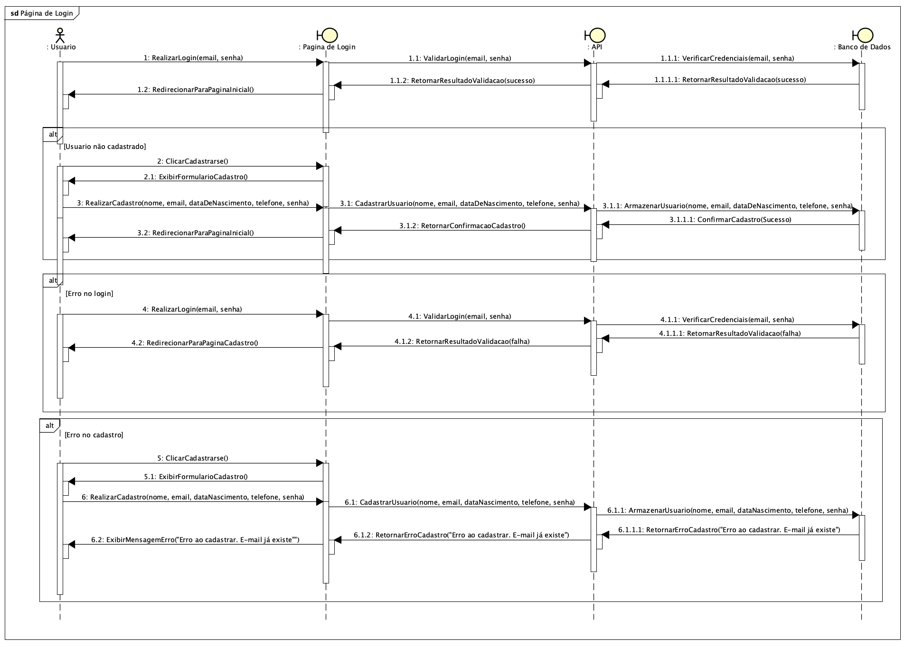  

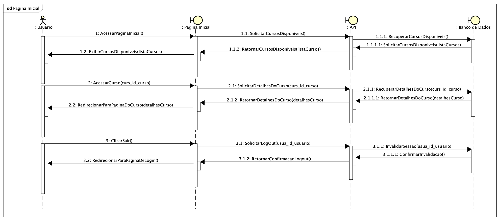  

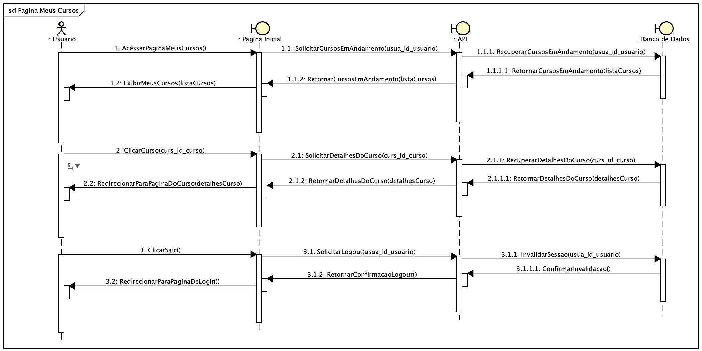  

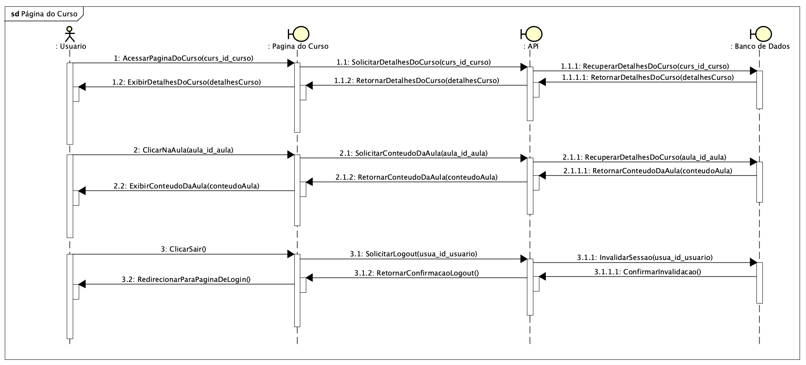  

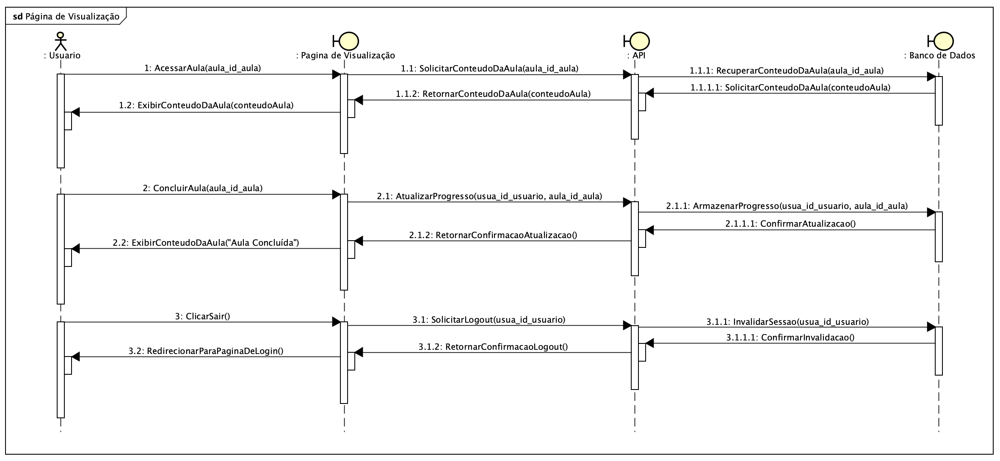  

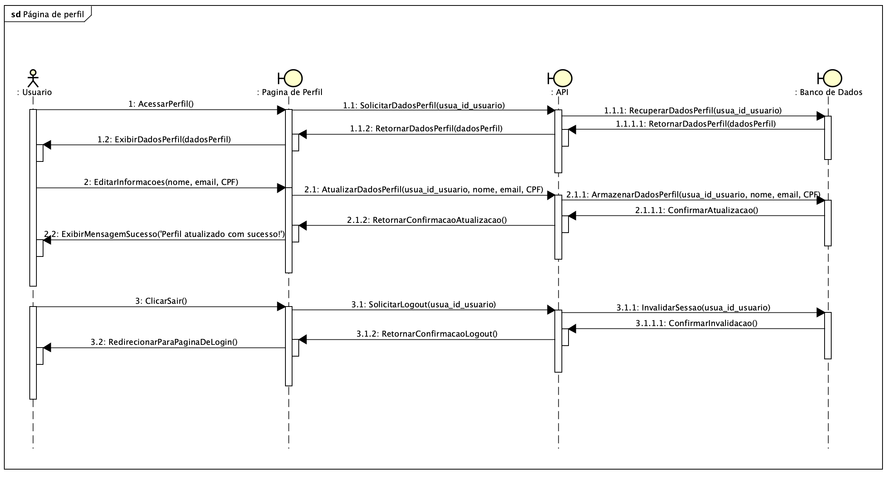  

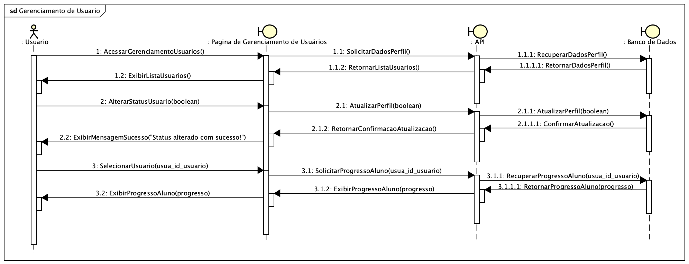  

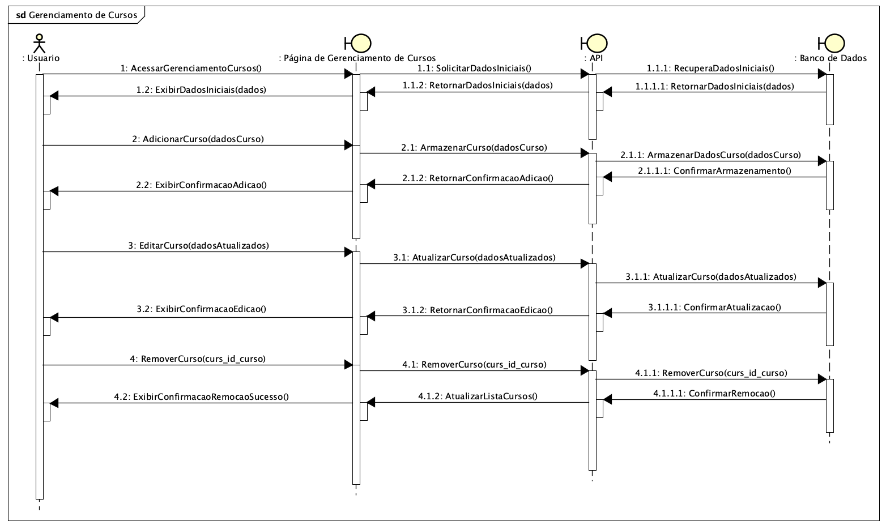  

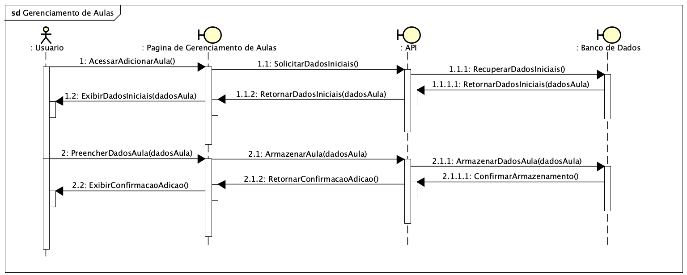  

--- 

# DIAGRAMAS DE ATIVIDADE

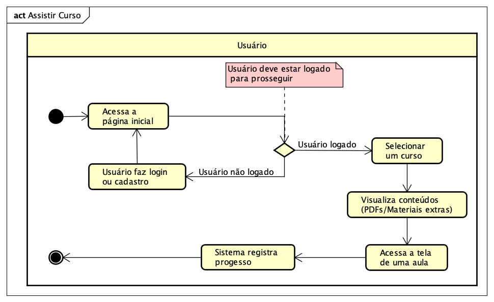

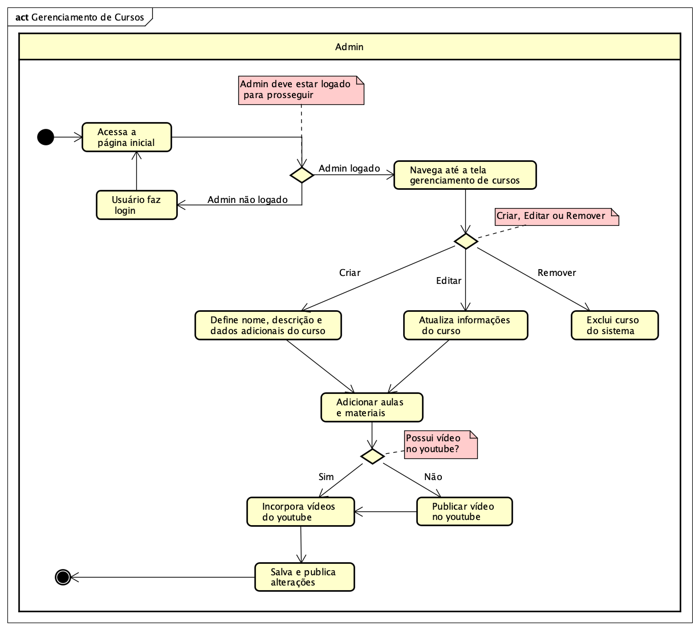

---  

# EQUIPE DE DESENVOLVIMENTO E CLIENTE

### DESENVOLVEDORES

|NOME|CARGO|E-MAIL|
|:---|:---|:---|
|Matheus Lucas Batista|Gerente de projeto/Analista|matheusifro2020@gmail.com|
|Luis Felipe Lopes|Analista|luis.felipe.lopes1275@gmail.com|
|Thiago Hens Suchi|Analista|thiagohenssuchi@gmail.com|
|Yuri Ribeiro Zetoles|Analista|yurizetoles0123@gmail.com|

### CLIENTE

|NOME|
|:---|
|Marco Antônio Augusto de Andrade|

# REFERÊNCIAS

Esta subseção apresenta as referências aos documentos que utilizamos no auxílio à construção deste documento.
* [UML](https://www.omg.org/spec/UML/2.5/About-UML/)
* [Práticas para Especificação de Requisitos IEEE-830](https://ieeexplore.ieee.org/document/720574)
---  

[ [INÍCIO](#projeto-de-software---fórmula-x) ]
